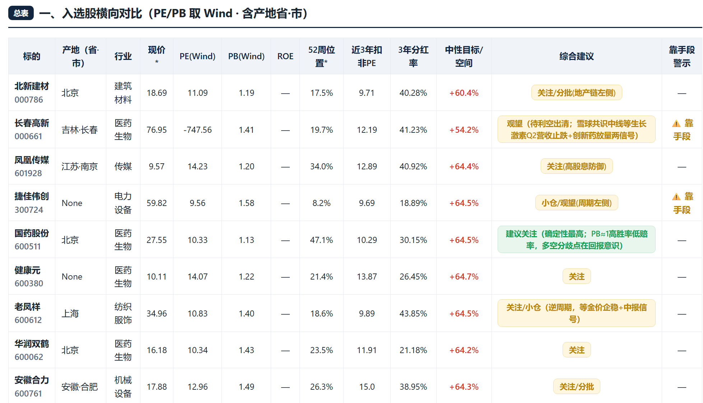
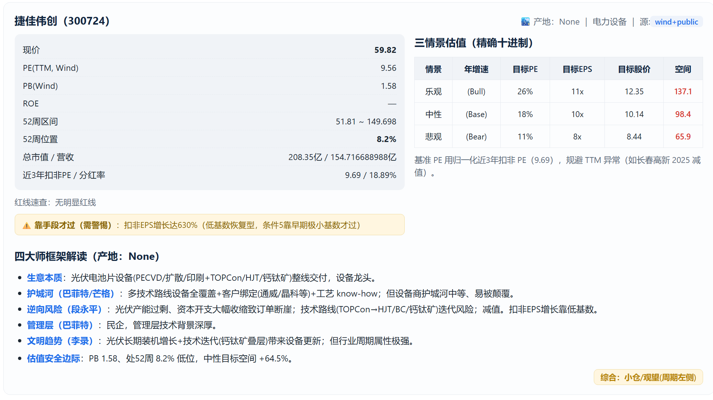

# 老登股推荐（Graham 防御型 → 四大师分析）

> **当前版本：v2.0.0**（2026-08-05 发布 · 详见 [release-notes-v2.0.0.md](release-notes-v2.0.0.md)）

把 Graham 防御型选股筛出的「又便宜又稳」的股票，套用四大师框架（巴菲特/芒格/段永平/李录）做分析总结，自动产出带产地标注、三情景估值的 HTML 投研报告。

## 原理
先用 Graham 七条件选出低估值、高分红、经营稳健的「老登股」，再用四大师框架判断它「为什么值得、值多少、风险在哪」。

## 效果预览

**入选股横向对比表**（PE/PB 取 Wind、含产地省·市、靠手段警示）：



**单只深度分析卡**（基本面 + 三情景估值 + 四大师框架解读）：



## v2.0.0 亮点（相对 v1.0.3）
- **修复 Graham 分红条根因 bug**：westock 分红接口只回当年、拿不到 10 年分红史 → 改为「两遍筛选 + Wind MCP 分红史」（pass1 跳分红缩窄候选 → Wind 拉幸存者 10 年每股派息 → pass2 带分红复筛）。此前旧流程筛不出完整入选，现全市场 1456 候选 → 24 只入选，可复现。
- **Wind 估值通路打通**：新增 `scripts/write_wind_cache.py`，用 `get_stock_price_indicators` 批量拉 PE/PB/股息率/52周高低/总股本 → 报告 `data_source=wind+public`，Wind 权威值优先、公开接口兜底。
- **新增 3 个脚本**：`build_div.py`（Wind 股息 → graham 兼容 div.txt）、`write_wind_cache.py`（Wind 缓存写入，避免手敲 JSON）、`_selftest_gw.py`（16 边界用例回归自测）。
- **「靠手段才过」警示**：平滑 PE 掩护 / 低基数 EPS 增长才过线的标的，在表格+报告里特殊标注。
- **四大师解读不再空白**：`gen_report.py` 优先读运行目录 `four_masters.json`，缺解读渲染可见黄框。
- **防呆修复**：`gen_summary_table.py` 拒绝覆盖输入文件；`graham_westock.py` EPS 增长封顶 999.99 防除零爆炸值。

## 前置（运行时会自检查，缺什么会提示）
- 本仓库（Graham 筛选器已内置，克隆这一个即可）
- 行情/财务数据：建议直接通过 **Wind MCP** 接入；或 WorkBuddy 用户启用内置 westock 技能；其他环境也可 `npm i -g westock-data westock-tool` 并设 `WESTOCK_DATA` / `WESTOCK_TOOL`
- Node.js 18+（仅全自动拉数据时需要）
- Python 3.10+（脚本基于标准库）
- Wind MCP 可选，不装自动用公开接口

## 怎么用
最简：克隆后跟 AI 说「用老登股推荐跑一份今天的防御型选股四大师报告」，AI 会自动跑完出 HTML。
或命令行：
```
python scripts/run_pipeline.py all --win 10 --mv 50 --rev 20 --out ./out --source public
```
只分析已有选股：`python scripts/run_pipeline.py analyze 你的选股.md ./out --source public`

## 兼容性
本技能不绑定任何平台：任何能运行 Python 3 + Node.js 的 AI Agent（WorkBuddy、Claude、Cursor、通用命令行 Agent 等）都能直接调用，缺依赖时运行会自动自检并给出安装指引，补齐后重跑即可。

## 缺依赖会怎样
运行自动检测环境。缺 Node / 数据组件时，会打印缺什么 + 怎么装（含 Wind MCP / npm 两种方式），补齐后重跑同一条命令即继续。

## 免责
AI 框架化推理 + 机械估值，非投资建议；数据来自公开接口，可能延迟误差。
